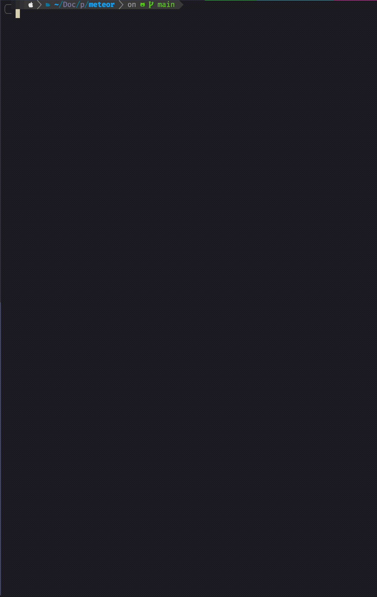

<div align="center">
  <h1>️☄ meteor ☄</h1>
  
  <h5>Meteor is a simple, highly customisable CLI tool that helps you to write <a href="https://www.conventionalcommits.org/">conventional commits</a> with git.</h5>
</div>


You can call `meteor` where you'd normally type `git commit`. All flags supported in `git commit` will still work.


## Installation
### Homebrew
```console
brew tap stefanlogue/tools
brew install meteor
```
### Go
Install with Go (1.21+):

```console
go install github.com/stefanlogue/meteor@latest
```

Or grab a binary from [the latest release](https://github.com/stefanlogue/meteor/releases/latest).

## Customisation

You can customise the options available by creating a `.meteor.json` file anywhere in the directory tree (at or above the current working directory). The config file closest to the current working directory will be preferred. This enables you to have different configs for different parent directories, such as one for your personal work, one for your actual work, one for open source work etc.
For global configurations you can create a `config.json` file in the `~/.config/meteor/` directory.



The content should be in the following format:

```json
{
  "boards": [
    { "name": "COMP" },
    { "name": "PERS" }
  ],
  "coauthors": [
    { "name": "John Doe", "email": "john.doe@email.com" }
  ],
  "prefixes": [
    { "type":  "feat", "description":  "a new feature"},
    { "type":  "fix", "description":  "a bug fix"},
    { "type":  "bug", "description":  "introducing a bug"}
  ],
}
```

If you use boards (Jira etc) but need a way to have commits without one, add the following to the `boards` array:
```json
{
  "boards": [
    { "name": "COMP" },
    { "name": "NONE" }
  ]
}
```

And if you want to skip the intro screen to save a keypress, add the following to your config:
```json
{
  "showIntro": false
}
```
